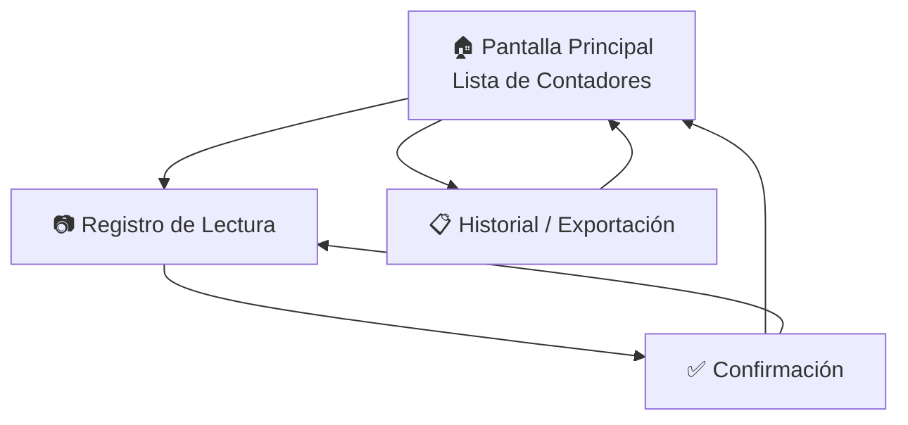

# Diseño UI/UX - App Lectura de Contadores de Agua (MVP)

Documento de diseño para aplicación móvil Android offline destinada a registrar lecturas de contadores de agua potable en comunidades rurales.

---

## 1. Arquitectura de Pantallas



---

## 2. Pantallas Detalladas

### 2.1 Pantalla Principal - Lista de Contadores


#### Estructura

| Zona         | Componente          | Descripción                       |
| ------------ | ------------------- | --------------------------------- |
| **Header**   | Título + Fecha      | "Lecturas del Día" + fecha actual |
| **Búsqueda** | Campo de texto      | Filtrado por nombre/sector        |
| **Lista**    | Cards de contadores | Información esencial por contador |
| **Footer**   | Botón flotante      | Acceso a historial                |

#### Componentes UI Recomendados (Flutter)

```dart
// Widgets principales
Scaffold(
  appBar: AppBar(),           // Header simple
  body: Column([
    SearchBar(),              // Búsqueda rápida
    Expanded(ListView.builder()) // Lista scrolleable
  ]),
  floatingActionButton: FAB() // Acceso a historial
)
```

#### Estados de los Contadores

| Estado         | Indicador Visual | Color             |
| -------------- | ---------------- | ----------------- |
| **Pendiente**  | Círculo vacío ○  | Gris `#6B7280`    |
| **Registrado** | Check ✓          | Verde `#10B981`   |
| **Con error**  | Triángulo ⚠      | Naranja `#F59E0B` |

#### Card de Contador

```
┌─────────────────────────────────────────┐
│  ○  Juan Pérez García                   │
│      Sector: El Rosario - Lote 45       │
│      Última: 1,234 m³ (Nov 2025)        │
│                                    →    │
└─────────────────────────────────────────┘
```

**Acciones:** Tap para abrir registro de lectura

---

### 2.2 Pantalla de Registro de Lectura


#### Estructura

| Zona        | Componente            | Área de pantalla |
| ----------- | --------------------- | ---------------- |
| **Header**  | Nombre + Botón volver | 8%               |
| **Cámara**  | Vista previa en vivo  | 45%              |
| **Lectura** | Input numérico grande | 25%              |
| **Estado**  | GPS + Fecha           | 7%               |
| **Acción**  | Botón guardar         | 15%              |

#### Componentes UI Detallados

**Vista de Cámara:**
```dart
CameraPreview(
  child: Stack([
    // Marco guía para centrar contador
    Container(
      decoration: BoxDecoration(
        border: Border.all(color: Colors.white, width: 2),
        borderRadius: BorderRadius.circular(8),
      ),
    ),
    // Botón captura superpuesto
    Positioned(
      bottom: 16,
      child: FloatingActionButton(
        icon: Icons.camera_alt,
        backgroundColor: Colors.white,
      ),
    ),
  ]),
)
```

#### Justificación de Decisiones UX

### 4.1 Principio de Mínima Carga Cognitiva

| Decisión                           | Justificación                                      |
| ---------------------------------- | -------------------------------------------------- |
| **Máximo 3 acciones por pantalla** | Reduce confusión y errores en usuarios no técnicos |
| **Flujo lineal**                   | El usuario siempre sabe dónde está y qué sigue     |
| **Botones con íconos + texto**     | Doble refuerzo para comprensión inmediata          |

### 4.2 Optimización para Condiciones Adversas

| Condición                | Solución                                         |
| ------------------------ | ------------------------------------------------ |
| **Luz solar directa**    | Alto contraste (ratio mínimo 7:1), fondos claros |
| **Celulares gama baja**  | Animaciones simples, sin sombras complejas       |
| **Usuarios con guantes** | Botones mínimo 48x48dp, spacing generoso         |
| **Sin internet**         | Todo almacenado local, sin spinners de carga     |
